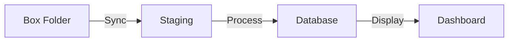

# Admin Panel

The admin panel at `/admin` provides system management for users with `is_admin=true`.

---

## Sections

| Section | Route | Purpose |
|---------|-------|---------|
| Overview | `/admin` | System stats, health indicators |
| Users | `/admin/users` | User CRUD, role management |
| Groups | `/admin/groups` | Group CRUD, membership management |
| Sites | `/admin/sites` | Site configuration |
| Audit Log | `/admin/audit` | Security event history |
| Pipeline | `/admin/pipeline` | Data import configuration |
| Box Integration | `/admin/box` | Box.com cloud sync setup |
| Database | `/admin/database` | Encryption status, backup/reset |

---

## Overview

Dashboard showing system health:

**Stats Cards**

| Metric | Example | Notes |
|--------|---------|-------|
| Total Users | 12 | Shows "X active" subtitle |
| Groups | 4 | |
| Monitoring Sites | 8 | Shows "X active" subtitle |
| Sensor Records | 145,230 | |
| Parameters | 6 | |
| Equipment Groups | 3 | |

**System Information**

| Field | Example |
|-------|---------|
| Database | SQLCipher (Encrypted) |
| API Version | 1.0.0 |
| Data Coverage | Jan 2024 - Dec 2024 |
| Demo Mode | Disabled |

### API

```python
@router.get("/stats")
def get_system_stats(db: DbSession, admin: AdminUser):
    return SystemStatsResponse(
        total_users=db.query(User).count(),
        active_users=db.query(User).filter(User.is_active).count(),
        total_groups=db.query(Group).count(),
        total_sites=db.query(Site).count(),
        # ...
    )
```

---

## User Management

Create, edit, and delete users. Assign admin privileges and group memberships.

### Actions

| Action | Effect |
|--------|--------|
| Create user | New account with email/password |
| Edit user | Update name, email, admin status |
| Change password | Set new password, invalidates existing tokens |
| Activate/Deactivate | Enable or disable login |
| Delete | Permanent removal |

### Password Changes

When an admin changes a user's password:

```python
user.password_hash = get_password_hash(new_password)
user.token_version += 1  # Invalidate all existing sessions
```

The user is logged out immediately and must use the new password.

---

## Group Management

Groups control which sites users can access. Users see all sites from all their groups combined.

### How It Works

```
Group "Davis Research"          Group "Tomato Project"
├── Members: Alice, Bob         ├── Members: Bob, Carol
└── Sites: DAV_001, DAV_002     └── Sites: TOM_001, TOM_002
```

**Result:**

| User | Groups | Sites They Can Access |
|------|--------|----------------------|
| Alice | Davis Research | DAV_001, DAV_002 |
| Bob | Davis Research, Tomato Project | DAV_001, DAV_002, TOM_001, TOM_002 |
| Carol | Tomato Project | TOM_001, TOM_002 |

Bob is in both groups, so he sees sites from both. Alice and Carol only see their respective group's sites.

### Actions

| Action | Endpoint |
|--------|----------|
| Create group | `POST /api/groups` |
| Add user to group | `POST /api/groups/{id}/users` |
| Remove user | `DELETE /api/groups/{id}/users/{uid}` |
| Add site to group | `POST /api/groups/{id}/sites` |
| Remove site | `DELETE /api/groups/{id}/sites/{sid}` |

---

## Site Management

Configure monitoring sites. Site data is domain-specific to the Crop Sensing Group's dashboard.

### Fields

| Field | Description |
|-------|-------------|
| `site_code` | Unique identifier (e.g., `VAC_001`) |
| `name` | Display name |
| `latitude`/`longitude` | Map position |
| `crop_id` | Associated crop type |
| `is_active` | Whether site appears in dashboard |

---

## Audit Log

Security event history. All significant actions are logged:

| Action | When |
|--------|------|
| `login_success` | User logs in |
| `login_failed` | Failed login attempt |
| `user_created` | Admin creates user |
| `user_updated` | Admin edits user |
| `password_changed` | Password reset |
| `group_created` | New group |
| `site_created` | New site |

### Filtering

```
GET /api/admin/audit?
  user_id=...         # Filter by user
  action=...          # Filter by action type
  search=...          # Search across fields
  start_date=...      # Date range
  end_date=...
```

### Export

Export to CSV for compliance/reporting:

```
GET /api/admin/audit/export
```

---

## Pipeline Configuration

Configure data import settings for CSV files from dataloggers.

!!! info "Domain-Specific"
    The data format and processing logic are specific to CSI dataloggers and the Crop Sensing Group's dashboard.

---

## Box Integration

Connect to Box.com for automated file ingestion.

### Setup

1. Create Box Developer App
2. Configure OAuth credentials in `.env`
3. Authorize via `/admin/box`
4. Select folder to monitor

### How It Works



Files are synced from Box, validated, processed through the pipeline, and loaded into the database.

---

## Database Management

### Encryption Status

Shows whether SQLCipher encryption is active:

- **SQLCipher** - Database file is encrypted at rest
- **SQLite** - Unencrypted (development only)

### Demo Mode

When `DEMO_MODE=true` is set in the environment:

- Shows "Demo Mode" indicator in the System Information panel
- Disables Box integration (prevents modifying real cloud storage)
- All other functionality remains available for demonstration purposes

This is used for public demos where you want people to explore the UI without affecting real data or external services.

---

## Access Control

All admin endpoints require `is_admin=true`:

```python
@router.get("/users")
def list_users(db: DbSession, admin: AdminUser):
    # AdminUser dependency rejects non-admins with 403
    return db.query(User).all()
```

Non-admin users see no admin navigation and get 403 if they try to access admin API endpoints directly.

---

## Frontend Structure

```
frontend/src/pages/admin/
├── AdminLayout.tsx     # Sidebar nav, outlet for pages
├── Overview.tsx        # Stats dashboard
├── Users.tsx           # User CRUD table
├── Groups.tsx          # Group management
├── Sites.tsx           # Site configuration
├── AuditLog.tsx        # Log viewer with filters
├── Pipeline.tsx        # Import settings
├── BoxIntegration.tsx  # Box OAuth + folder picker
└── DatabaseManagement.tsx
```

`AdminLayout` wraps all admin pages with a consistent sidebar and ensures admin access.

---

## Next Steps

- [Authentication](authentication.md) - How admin access is enforced
- [Data Handling](data-handling.md) - Pipeline and import process
- [Configuration](../getting-started/configuration.md) - Environment variables
