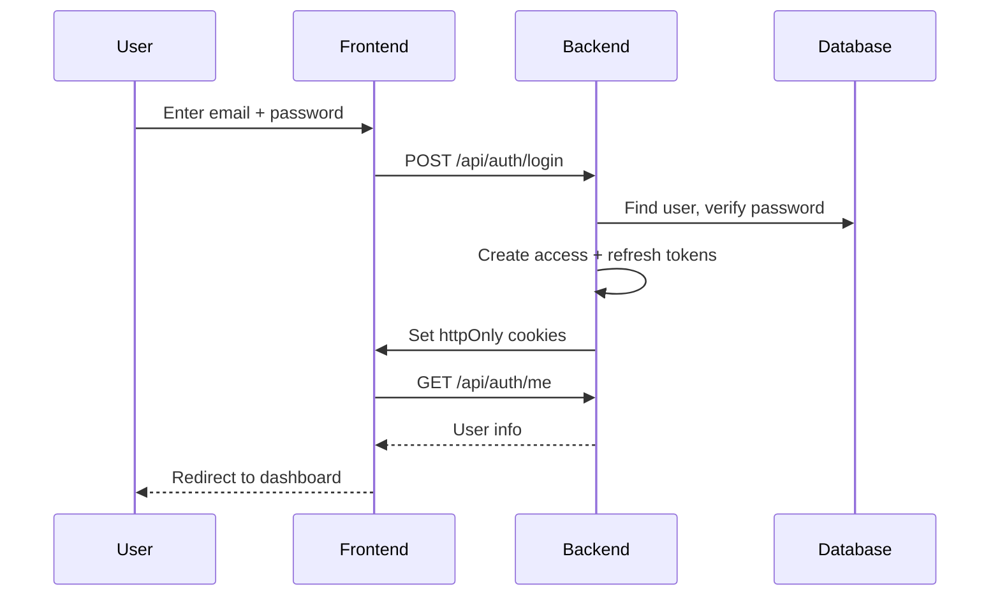
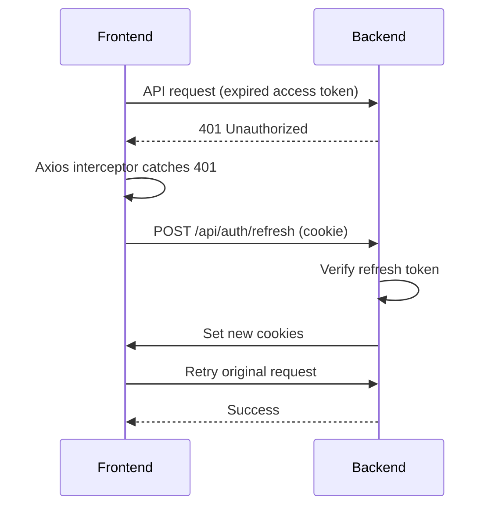
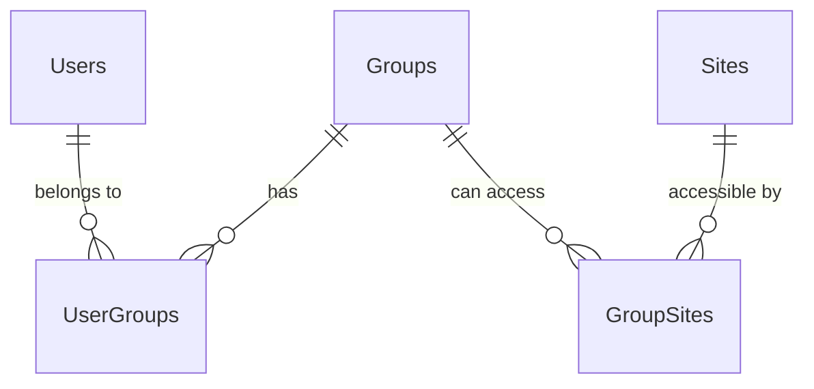

# Authentication

JWT-based authentication with httpOnly cookies, dual tokens, and instant revocation.

---

## Overview

| Feature | Implementation | Benefit |
|---------|---------------|---------|
| Token-based | JWT | Stateless, scalable |
| Dual tokens | Access (30 min) + Refresh (7 days) | Security + convenience |
| Cookie storage | httpOnly cookies | XSS protection |
| Instant revocation | Token versioning | Immediate logout |
| Password security | bcrypt | Industry standard |

---

## Login Flow



### Backend Code

```python
# backend/api/auth.py
@router.post("/login")
@limiter.limit("5/minute")  # Rate limiting
def login(login_data: LoginRequest, response: Response, db: DbSession):
    user = authenticate_user(db, login_data.email, login_data.password)
    if not user:
        raise HTTPException(401, "Incorrect email or password")

    tokens = create_token_for_user(db, user)

    # Set httpOnly cookies (not accessible to JavaScript)
    _set_auth_cookies(response, tokens.access_token, tokens.refresh_token)
    return tokens
```

---

## Dual Token System

| Token | Lifetime | Cookie Path | If Stolen |
|-------|----------|-------------|-----------|
| Access | 30 min | `/` (all requests) | Limited damage - expires soon |
| Refresh | 7 days | `/api/auth` only | Less exposed, but more serious |

Both tokens are stored in httpOnly cookies - JavaScript cannot read them. This prevents XSS attacks from stealing tokens.

### Token Refresh

When the access token expires:



This happens silently - the user stays logged in for up to 7 days without re-entering credentials.

### Frontend Implementation

```typescript
// frontend/src/lib/api.ts
const api = axios.create({
  withCredentials: true,  // Send cookies automatically
});

api.interceptors.response.use(
  (response) => response,
  async (error) => {
    if (error.response?.status === 401 && !error.config._retry) {
      error.config._retry = true;
      await api.post('/api/auth/refresh');  // Cookies sent automatically
      return api(error.config);  // Retry with new cookies
    }
    return Promise.reject(error);
  }
);
```

---

## Token Versioning (Instant Revocation)

JWTs are stateless - normally a token works until it expires. Token versioning solves this.

### How It Works

Each user has a `token_version` in the database:

```python
class User(Base):
    token_version: Mapped[int] = mapped_column(Integer, default=1)
```

Every token includes this version. On each request, the token's version is checked against the database:

```python
token_version = payload.get("token_version")
if token_version != user.token_version:
    raise HTTPException(401, "Token has been revoked")
```

### When Version Increments

| Action | Effect |
|--------|--------|
| Password change | `user.token_version += 1` |
| Logout | `user.token_version += 1` |
| Admin disables account | `user.token_version += 1` |

All existing tokens become invalid instantly.

---

## Role-Based Access Control

| Role | `is_admin` | Access |
|------|------------|--------|
| Admin | `true` | All features, all sites, user management |
| User | `false` | Sites in their groups only |

### Backend Enforcement

```python
from backend.core.dependencies import AdminUser

@router.get("/users")
def list_users(db: DbSession, admin: AdminUser):  # <-- Admin required
    return db.query(User).all()
```

The `AdminUser` dependency rejects non-admins with 403.

---

## Group-Based Access Control

Users belong to groups, groups have access to sites:



### Access Calculation

At login, accessible sites are computed:

```python
if user.is_admin:
    sites = all_sites
else:
    user_groups = user's groups
    sites = sites belonging to those groups
```

At request time, `AccessContext` filters data:

```python
@router.get("/data")
def get_data(access: AccessContext, db: DbSession):
    if not access.is_admin:
        query = query.filter(Site.id.in_(access.site_ids))
```

---

## Password Security

Passwords are hashed with bcrypt:

```python
from passlib.context import CryptContext

pwd_context = CryptContext(schemes=["bcrypt"])

def get_password_hash(password: str) -> str:
    return pwd_context.hash(password)

def verify_password(plain: str, hashed: str) -> bool:
    return pwd_context.verify(plain, hashed)
```

**Why bcrypt:**

- Salted - identical passwords have different hashes
- Slow - intentionally expensive (prevents brute force)
- Adaptive - work factor can increase as hardware improves

---

## API Endpoints

| Endpoint | Method | Auth | Rate Limit | Description |
|----------|--------|------|------------|-------------|
| `/api/auth/login` | POST | No | 5/min | Get tokens |
| `/api/auth/logout` | POST | Yes | - | Invalidate tokens |
| `/api/auth/refresh` | POST | Cookie | 10/min | Refresh tokens |
| `/api/auth/me` | GET | Yes | - | Current user info |

---

## Audit Logging

All auth events are logged:

| Action | Logged |
|--------|--------|
| `login_success` | User ID, email, IP |
| `login_failed` | Email attempted, IP |
| `password_changed` | Who changed, target |
| `user_deactivated` | Who, target |

View at `/admin/audit` or export as CSV.

---

## Cookie Settings

| Variable | Default | Production |
|----------|---------|------------|
| `COOKIE_SECURE` | `false` | `true` (requires HTTPS) |
| `COOKIE_SAMESITE` | `lax` | `lax` |
| `COOKIE_DOMAIN` | `None` | Set for subdomains |

---

## Troubleshooting

??? failure "Token has been revoked"
    User's `token_version` changed (password change, logout, admin action). Log in again.

??? failure "Invalid or expired token"
    Access token expired and refresh failed. Possible causes:

    - Refresh token also expired (>7 days)
    - User deactivated
    - Token version changed

    Solution: Log in again.

??? failure "Admin access required"
    Non-admin trying to access admin endpoint. Use an admin account.

---

## File Reference

| File | Purpose |
|------|---------|
| `backend/api/auth.py` | Login, logout, refresh endpoints |
| `backend/core/security.py` | Token creation, password hashing |
| `backend/core/dependencies.py` | `CurrentUser`, `AdminUser` |
| `backend/core/access_control.py` | Group-based access |
| `backend/services/auth.py` | `authenticate_user`, `create_token_for_user` |
| `frontend/src/lib/api.ts` | Axios interceptor for refresh |
| `frontend/src/stores/authStore.ts` | Auth state |
