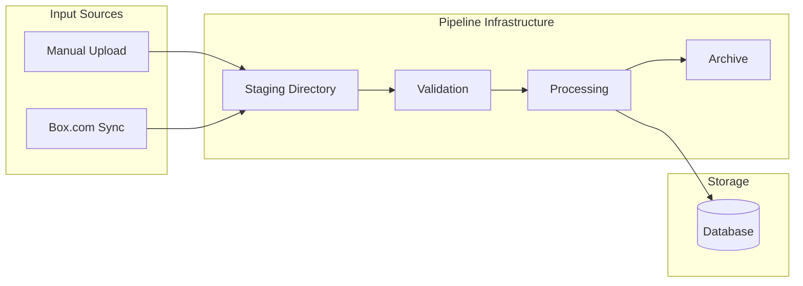
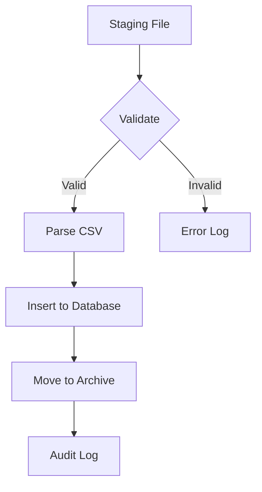
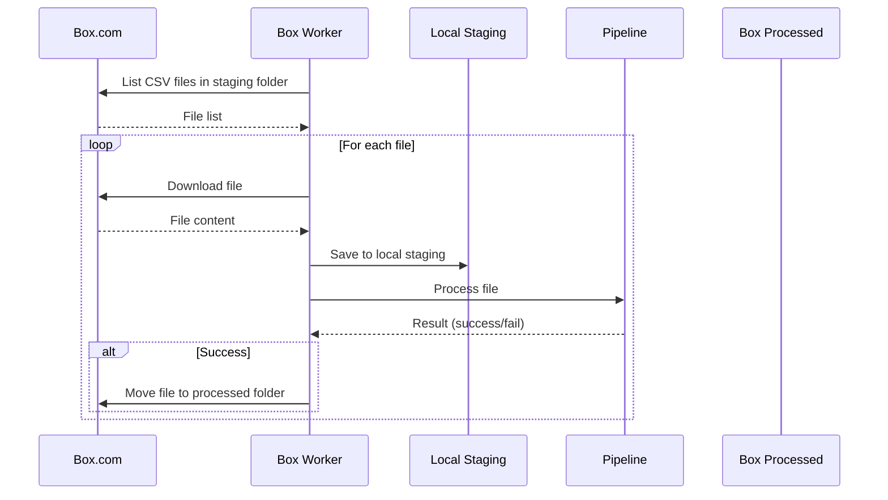

# Data Handling

File upload, staging, processing pipeline, and Box.com integration.

!!! info "What This Covers"
    This page covers the data flow infrastructure - how files get uploaded, staged, validated, processed, and synced from Box. For information specific to the agricultural sensor data and dashboard visualization, see the [Crop Sensing Group's repository](https://github.com/crop-sensing/crop-dashboard).

---

## Overview



---

## Manual Upload

Admins can upload CSV files via the admin panel.

### Upload Flow

1. Admin selects file at `/admin/pipeline`
2. File validated (must be `.csv`, max 100MB)
3. Saved to staging directory
4. Admin reviews and triggers processing

### API

```python
@router.post("/upload")
async def upload_file(file: UploadFile, admin: AdminUser, db: DbSession):
    # Validate file type
    if not file.filename.endswith('.csv'):
        raise HTTPException(400, "Only CSV files are allowed")

    # Check size (max 100MB)
    content = await file.read()
    if len(content) > 100 * 1024 * 1024:
        raise HTTPException(400, "File too large")

    # Save to staging
    filepath = pipeline_worker.save_uploaded_file(content, file.filename)

    # Audit log
    db.add(AuditLog(user_id=admin.id, action='file_upload', ...))

    return {"filename": filepath.name, "size": len(content)}
```

---

## Staging Directory

Files land in `uploads/staging/` before processing.

```
uploads/
├── staging/           # Files awaiting processing
│   ├── VAC_001_2024.csv
│   └── DAV_002_2024.csv
└── processed/         # Archive of processed files
    └── 2024-12/
        └── VAC_001_2024.csv
```

### Status Check

```python
@router.get("/status")
def get_pipeline_status(admin: AdminUser):
    return {
        "staging_files": [...],  # Files ready to process
        "processed_files": [...],  # Recently processed
        "is_processing": False,
        "last_run": "2024-12-01T10:30:00"
    }
```

---

## Processing

When processing is triggered:



### Trigger Processing

```python
@router.post("/process")
def process_files(request: ProcessRequest, admin: AdminUser, db: DbSession):
    results = pipeline_worker.process_all_staging_files(
        db,
        user_id=admin.id,
        filenames=request.filenames  # Optional: specific files
    )
    return results
```

### Processing Result

```json
{
  "filename": "VAC_001_2024.csv",
  "status": "success",
  "records_imported": 1250,
  "records_skipped": 3,
  "records_duplicate": 12,
  "error_message": null,
  "processing_time": 2.34
}
```

---

## Box.com Integration

Automated file sync from Box cloud storage.

??? abstract "Setting Up Box Developer App"

    Before configuring the app, you need Box API credentials:

    1. Create a Box Developer account at [app.box.com/developers/console](https://app.box.com/developers/console)
    2. Create a Custom App with OAuth 2.0 authentication
    3. Copy your Client ID and Client Secret
    4. Set the redirect URI to match your deployment

### Setup

1. Configure OAuth credentials in `.env`:

```bash
BOX_CLIENT_ID=your-client-id
BOX_CLIENT_SECRET=your-client-secret
BOX_REDIRECT_URI=https://yourdomain.com/admin/box/callback
```

2. Authorize at `/admin/box`
3. Select folder to monitor

### Sync Flow



Files are deduplicated by hash during processing - if a file was already imported, it's skipped.

### Sync Scheduling

The Box worker runs on a schedule (configurable). New files are:

1. Downloaded to staging
2. Automatically processed
3. Archived after success

### API Endpoints

| Endpoint | Method | Description |
|----------|--------|-------------|
| `/api/box/status` | GET | Connection status |
| `/api/box/auth-url` | GET | Get OAuth authorization URL |
| `/api/box/callback` | POST | Handle OAuth callback |
| `/api/box/folders` | GET | List available folders |
| `/api/box/configure` | POST | Set staging/processed folders |
| `/api/box/sync` | POST | Trigger manual sync |
| `/api/box/sync-status` | GET | Get current sync worker status |
| `/api/box/logs` | GET | Get recent sync logs |
| `/api/box/disconnect` | POST | Remove Box connection |
| `/api/box/backup/configure` | POST | Configure backup to Box |
| `/api/box/backup/run` | POST | Trigger manual backup |
| `/api/box/backup/configure` | DELETE | Disable backup |

---

## File Archive

Processed files are moved to `uploads/processed/` with a timestamp prefix:

```
uploads/processed/
├── 20241201_103045_VAC_001_2024.csv
├── 20241201_103112_VAC_002_2024.csv
└── 20241215_091530_DAV_001_2024.csv
```

Archive entries are tracked in the `file_archives` table:

```python
class FileArchive(Base):
    id: str
    original_filename: str
    file_hash: str          # SHA256 for duplicate detection
    file_size: int
    upload_date: datetime
    processed_date: datetime
    status: str             # pending, processing, completed, error
    error_message: str
    records_imported: int
    archived_path: str
```

---

## Validation

Files are validated before processing:

| Check | Failure Response |
|-------|------------------|
| File extension | Must be `.csv` |
| File size | Max 100MB |
| TIMESTAMP column | Required - used for time series |
| Site column | Required - maps to site records |
| File hash | Skip if already processed (duplicate detection) |
| CSI format | Auto-detected (TOA5 header), skips metadata rows |

---

## Error Handling

Processing errors are captured per-file:

```json
{
  "filename": "bad_data.csv",
  "status": "error",
  "records_imported": 0,
  "records_skipped": 0,
  "records_duplicate": 0,
  "error_message": "Missing TIMESTAMP column",
  "processing_time": 0.12
}
```

Failed files remain in staging for review. The `FileArchive` record also stores the error for later reference.

---

## Database Export/Import

Admins can export and import the entire database for backup or migration.

### Export

```python
@router.get("/database/export")
def export_database(admin: AdminUser, db: DbSession):
    # Returns the SQLite database file as a download
    # Filename: csg_dashboard_backup_YYYYMMDD_HHMMSS.db
```

### Import

```python
@router.post("/database/import")
def import_database(file: UploadFile, admin: AdminUser, db: DbSession):
    # Replaces entire database with uploaded file
    # Creates backup of existing database first
    # Only accepts encrypted (SQLCipher) databases
```

!!! warning "Database Import"
    Import replaces ALL existing data. A backup of the current database is created automatically before import.

---

## File Reference

| File | Purpose |
|------|---------|
| `backend/api/pipeline.py` | Upload, process, status, database export/import endpoints |
| `backend/api/box.py` | Box.com OAuth, sync, and backup endpoints |
| `backend/services/pipeline_worker.py` | File processing logic, staging/archive management |
| `backend/services/box_worker.py` | Box sync scheduler, database backup scheduler |
| `backend/services/box_integration.py` | Box API client (OAuth, file ops) |
| `backend/services/data_import.py` | Sample data import (for initial setup) |
| `backend/models/pipeline.py` | FileArchive, PipelineConfig, AuditLog models |
| `backend/models/box_connection.py` | BoxConnection, BoxSyncLog models |
| `backend/schemas/pipeline.py` | Request/response schemas |

---

## Next Steps

- [Admin Panel](admin-panel.md) - Pipeline configuration UI
- [Configuration](../getting-started/configuration.md) - Box credentials setup
- [Authentication](authentication.md) - Admin access requirements
