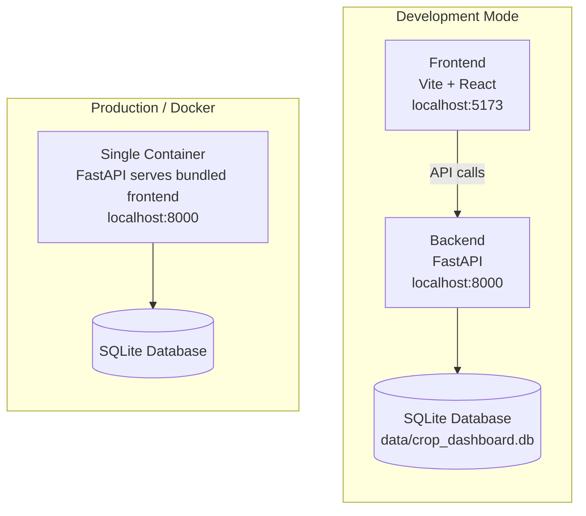

# Quick Start

Get the platform running locally. Two terminals - one for the backend, one for the frontend.

---

## Try It First

Want to see it running before setting anything up? There's a live demo on Hugging Face:

**<a href="https://richtext-csg-dash-demo.hf.space" target="_blank">https://richtext-csg-dash-demo.hf.space</a>**

!!! info "Demo Data"
    All data in the demo is synthetically generated for demonstration purposes. Site locations, sensor measurements, and other values don't represent real-world data or actual monitoring sites.

---

## Requirements

| Tool | Version | Check with |
|------|---------|------------|
| Python | 3.11+ | `python --version` |
| Node.js | 18+ | `node --version` |
| npm | 9+ | `npm --version` |

---

## Clone the Repository

```bash
git clone https://github.com/RichardStoker-USDA/crop-dashboard-platform.git
cd crop-dashboard-platform
```

---

## Option A: Docker (Fastest)

If you have Docker installed, this is the quickest way to try the production build locally:

```bash
# Build the image
docker build -t cropdash .

# Run with required environment variables
docker run -p 8000:8000 \
  -e SECRET_KEY=dev-secret-key-at-least-32-characters \
  -e DB_ENCRYPTION_KEY=dev-encryption-key-for-local-testing \
  -e ADMIN_EMAIL=admin@cropdash.dev \
  -e ADMIN_PASSWORD=changeme123 \
  cropdash
```

Open http://localhost:8000 - the frontend is bundled and served by the backend in production mode.

!!! tip "Docker Details"
    The Dockerfile uses a multi-stage build: Node builds the frontend, then everything is served from a single Python container. This mirrors how the app runs in production.

---

## Option B: Development Setup

For active development, run the backend and frontend separately with hot reload.

### Backend Setup

#### Create a Conda Environment

=== "macOS/Linux"

    ```bash
    conda create -p /path/to/environments/cropdash_env python=3.11
    conda activate /path/to/environments/cropdash_env
    ```

=== "Windows"

    ```bash
    conda create -p C:\envs\cropdash_env python=3.11
    conda activate C:\envs\cropdash_env
    ```

!!! tip "Why Conda?"
    Conda handles the SQLCipher dependency better than pip alone on most systems. If you prefer venv, you'll need to install libsqlcipher separately.

#### Install Dependencies

```bash
pip install -r backend/requirements.txt
```

#### Create Environment File

Copy the example and edit:

```bash
cp .env.example .env
```

At minimum, set these:

```bash title=".env"
# Security keys - generate with: python -c "import secrets; print(secrets.token_urlsafe(32))"
SECRET_KEY=your-secret-key-at-least-32-characters
DB_ENCRYPTION_KEY=your-database-encryption-key

# Initial admin account
ADMIN_EMAIL=admin@cropdash.dev
ADMIN_PASSWORD=changeme123
```

!!! warning "Development without SQLCipher"
    If you don't have SQLCipher installed and want to skip encryption during development:

    ```bash
    CROPDASH_DEV_ALLOW_UNENCRYPTED=true python -m uvicorn backend.main:app --reload
    ```

    This flag is intentionally not settable via `.env` to prevent accidentally running unencrypted in production.

#### Start the Backend

```bash
python -m uvicorn backend.main:app --host 0.0.0.0 --port 8000 --reload
```

You should see:

```
INFO:     Uvicorn running on http://0.0.0.0:8000
Database seeded successfully
Created admin user: admin@cropdash.dev
```

!!! note "Keep this terminal running"
    The backend needs to stay active. Open a new terminal for the frontend.

#### Verify It's Working

Open http://localhost:8000/docs - you should see the Swagger API documentation.

---

### Frontend Setup

In a **new terminal**:

```bash
cd crop-dashboard-platform/frontend
npm install
npm run dev
```

You should see:

```
VITE v5.0.8  ready in XXX ms

➜  Local:   http://localhost:5173/
```

---

## Log In

Open http://localhost:5173 in your browser (or http://localhost:8000 if using Docker).

### Default Accounts

| Account | Email | Password |
|---------|-------|----------|
| Admin | `admin@cropdash.dev` | `changeme123` |
| Test User | `testuser@example.com` | `testpass123` |

The admin account has full access - user management, group management, all sites, system settings.

---

## Architecture Overview



**Development mode**: Two processes with hot reload - frontend at `:5173`, backend at `:8000`.

**Production/Docker**: Single container serves everything from `:8000`.

---

## Hot Reload

Both servers support automatic refresh during development:

- **Backend**: Save a `.py` file → server restarts automatically
- **Frontend**: Save a `.tsx` file → browser updates without full refresh

---

## Stopping

Press `Ctrl+C` in each terminal (or `docker stop` for containers).

---

## Resetting the Database

If you need to start fresh:

```bash
rm data/crop_dashboard.db
# Restart the backend - it recreates the database with seed data
```

---

## Common Issues

??? failure "ModuleNotFoundError: No module named 'fastapi'"
    Your conda/virtual environment isn't activated. Run:
    ```bash
    conda activate /path/to/environments/cropdash_env
    ```

??? failure "Address already in use (port 8000)"
    Something else is using that port. Either stop it or use a different port:
    ```bash
    python -m uvicorn backend.main:app --port 8001 --reload
    ```
    (Update CORS_ORIGINS in .env if you change ports)

??? failure "CORS error in browser console"
    Check that `CORS_ORIGINS` in your `.env` includes your frontend URL:
    ```bash
    CORS_ORIGINS=["http://localhost:5173","http://127.0.0.1:5173"]
    ```

??? failure "Database is locked"
    SQLite allows one writer at a time. Close any database viewers (like DB Browser), check for stuck Python processes, and restart the backend.

??? failure "SQLCipher not found"
    Either install SQLCipher system-wide, or run without encryption for development:
    ```bash
    CROPDASH_DEV_ALLOW_UNENCRYPTED=true python -m uvicorn backend.main:app --reload
    ```

---

## Next Steps

- [Configuration](configuration.md) - Environment variables and settings
- [Stack Overview](../the-stack/overview.md) - How the pieces connect
- [Authentication](../features/authentication.md) - How login and permissions work
