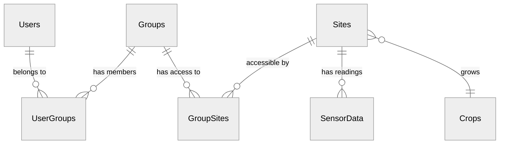

# Design Choices

This page covers the thinking behind the platform - why this stack, what tradeoffs were made, and how the architecture supports the goals.

---

## The Goal

The Crop Sensing Group had a working dashboard and data pipeline. What they needed was a way to serve it to multiple stakeholders with proper access control, authentication, and admin tools. The goal wasn't to reinvent their work - it was to wrap it in enterprise infrastructure that could scale.

That meant:

- Multiple users with secure login
- Role-based access control (admin vs regular users)
- Group-based data permissions (users see only their assigned sites)
- Admin panel for user/group/site management
- Encrypted database (storing credentials and tokens)
- Cloud integration for automated data ingestion

---

## Why This Stack

### Backend: FastAPI + Python

| Need | How FastAPI Delivers |
|------|---------------------|
| Python backend (data team knows Python) | 100% Python |
| Automatic API documentation | Swagger UI out of the box |
| Input validation | Pydantic integration |
| Modern async support | Built-in async/await |
| Type safety | First-class type hints |

Django was an option, but it's opinionated about structure and brings more than needed for an API-only backend. Flask is too minimal - you end up adding validation, docs generation, and structure yourself. FastAPI hits the sweet spot: enough structure to be productive, not so much that it gets in the way.

### Frontend: React + TypeScript

| Need | How React Delivers |
|------|---------------------|
| Interactive dashboards | Component-based, reactive updates |
| Industry standard | Skills transfer to other projects |
| Large ecosystem | Libraries for charts, maps, UI components |
| Type safety | TypeScript catches bugs before runtime |

Vue was considered - gentler learning curve - but React has broader adoption and a larger ecosystem. TypeScript adds compile-time type checking, which catches entire classes of bugs before they reach users.

### Database: SQLite + SQLCipher

| Need | How SQLite Delivers |
|------|---------------------|
| Simple setup | Just a file, no server |
| Portable | Copy one file to back up |
| Good enough performance | Handles concurrent reads well |
| Encryption | SQLCipher for at-rest encryption |

PostgreSQL is the standard for production apps, but it requires running a database server. SQLite is a single file - easy to back up, easy to move, no infrastructure to manage. The limitation is write concurrency (one writer at a time), but for a read-heavy dashboard where data imports happen occasionally, this isn't a bottleneck.

SQLCipher adds transparent encryption. The database file is unreadable without the key - important when storing credentials and OAuth tokens.

---

## Security from the Start

Security isn't something you add later. A few principles shaped the architecture:

### Centralized Access Control

Every endpoint that touches data uses the same access control pattern. There's a `UserAccessContext` that gets computed once per request:

```python
# backend/core/access_control.py
@dataclass
class UserAccessContext:
    user: User
    is_admin: bool
    site_ids: set[str]    # Sites this user can access
    site_codes: set[str]
    crop_ids: set[str]
```

Endpoints inject this context and use it to filter data:

```python
@router.get("/data")
def get_data(access: AccessContext, db: DbSession):
    query = db.query(SensorData)
    if not access.is_admin:
        query = query.filter(SensorData.site_id.in_(access.site_ids))
    return query.all()
```

This pattern makes it hard to forget access checks - if you use `AccessContext`, filtering is automatic.

### Tokens in httpOnly Cookies

JWT tokens are stored in httpOnly cookies, not localStorage. This means JavaScript can't read them, which protects against XSS attacks. The tradeoff is slightly more complexity in the auth flow, but the security benefit is worth it.

### Encrypted Database

SQLCipher encrypts the entire database file. Even if someone gets access to the server filesystem, the data is unreadable without the encryption key.

---

## Data Model

The access control model uses many-to-many relationships:



- **Users** belong to **Groups** (many-to-many via UserGroups)
- **Groups** have access to **Sites** (many-to-many via GroupSites)
- **Sites** have **SensorData** readings

When a user logs in, their accessible sites are computed from their group memberships. Admins bypass this and see everything.

---

## The Tradeoffs

Every decision has tradeoffs. Here are the ones accepted in this stack:

### SQLite vs PostgreSQL

**Accepted:** Write concurrency limits. One writer at a time means data imports from multiple admins would queue up.

**Why it's okay:** This is a read-heavy app. Dashboard viewers don't write. Imports happen occasionally, not constantly.

**When to reconsider:** If you need multiple backend instances or high-frequency writes, switch to PostgreSQL. The SQLAlchemy ORM makes this relatively painless.

### Python Backend vs Full JavaScript

**Accepted:** Two languages instead of one. Frontend is TypeScript, backend is Python.

**Why it's okay:** The data team knows Python. The Python ecosystem (pandas, numpy) is valuable for data work. React is the industry standard for frontends. Each language is optimal for its layer.

### SQLite File vs Managed Database Service

**Accepted:** No automatic failover, no managed backups.

**Why it's okay:** Simpler deployment, easier local development, portable. For a departmental tool, this is fine. Enterprise deployments can add backup scripts or switch to PostgreSQL.

---

## What's Reusable

The domain-specific pieces - sensor data, agricultural metrics, the dashboard visualizations - are the Crop Sensing Group's work. What's reusable from this platform is the infrastructure:

- **Authentication system** - JWT with httpOnly cookies, refresh tokens
- **Access control** - Role-based (admin/user) + group-based (data permissions)
- **Admin panel** - User management, group management, settings
- **Database layer** - SQLAlchemy + SQLCipher encryption
- **File handling** - Upload, validation, staging
- **Cloud sync** - Box integration for automated ingestion

This infrastructure could wrap any dashboard or data application that needs multi-user access with permissions.

---

## Next Steps

- [Decisions](decisions.md) - Specific technical decisions and alternatives considered
- [Stack Overview](../the-stack/overview.md) - How the pieces connect
- [Authentication](../features/authentication.md) - Deep dive into the auth system
