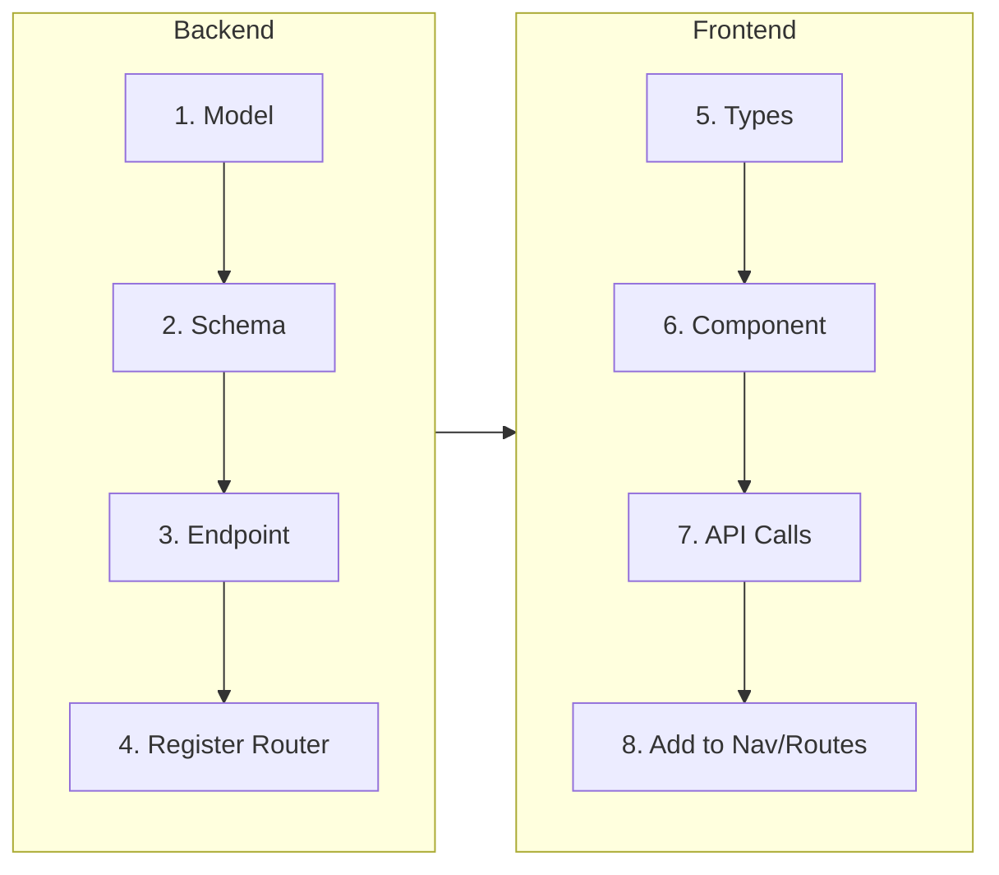

# Adding Features

Step-by-step guide to extending the application.

---

## Planning First

Before writing code, answer:

1. **What data?** Fields, types, relationships to existing data
2. **Who can access?** All users, admins only, or filtered by groups
3. **Where in the UI?** New page, existing page, admin panel
4. **Audit logging?** Generally yes for create/update/delete

---

## The Pattern

Every feature follows this flow:



---

## Example: Site Notes Feature

Users can add notes to sites. Notes visible to anyone with site access. Admins can delete any note.

### Step 1: Create Model

```python
# backend/models/note.py
import uuid
from datetime import datetime
from sqlalchemy import String, DateTime, Text, ForeignKey
from sqlalchemy.orm import Mapped, mapped_column, relationship
from backend.database import Base


class SiteNote(Base):
    __tablename__ = "site_notes"

    id: Mapped[str] = mapped_column(
        String(36), primary_key=True, default=lambda: str(uuid.uuid4())
    )
    site_id: Mapped[str] = mapped_column(
        String(36), ForeignKey("sites.id", ondelete="CASCADE"), index=True
    )
    user_id: Mapped[str] = mapped_column(
        String(36), ForeignKey("users.id", ondelete="SET NULL"), nullable=True
    )
    content: Mapped[str] = mapped_column(Text)
    created_at: Mapped[datetime] = mapped_column(DateTime, default=datetime.utcnow)

    site: Mapped["Site"] = relationship("Site")
    user: Mapped["User"] = relationship("User")
```

### Step 2: Export Model

```python
# backend/models/__init__.py
from backend.models.note import SiteNote

__all__ = [..., "SiteNote"]
```

### Step 3: Create Schemas

```python
# backend/schemas/note.py
from pydantic import BaseModel
from datetime import datetime


class NoteCreate(BaseModel):
    site_id: str
    content: str


class NoteResponse(BaseModel):
    id: str
    site_id: str
    user_id: str | None
    user_name: str
    content: str
    created_at: datetime
```

### Step 4: Create API Endpoints

```python
# backend/api/notes.py
from fastapi import APIRouter, HTTPException
from backend.core.dependencies import DbSession, CurrentUser, AccessContext
from backend.schemas.note import NoteCreate, NoteResponse
from backend.models import SiteNote, AuditLog

router = APIRouter()


@router.post("", response_model=NoteResponse, status_code=201)
def create_note(data: NoteCreate, db: DbSession, user: CurrentUser, access: AccessContext):
    # Check user has access to the site
    if data.site_id not in access.site_ids and not access.is_admin:
        raise HTTPException(403, "No access to this site")

    note = SiteNote(site_id=data.site_id, user_id=user.id, content=data.content)
    db.add(note)

    # Audit log
    db.add(AuditLog(
        user_id=user.id,
        action="note_created",
        resource_type="site_note",
        resource_id=note.id
    ))

    db.commit()
    db.refresh(note)

    return NoteResponse(
        id=note.id,
        site_id=note.site_id,
        user_id=note.user_id,
        user_name=user.full_name,
        content=note.content,
        created_at=note.created_at
    )


@router.get("", response_model=list[NoteResponse])
def list_notes(site_id: str, db: DbSession, access: AccessContext):
    if site_id not in access.site_ids and not access.is_admin:
        raise HTTPException(403, "No access to this site")

    notes = db.query(SiteNote).filter(SiteNote.site_id == site_id).all()
    return [NoteResponse(...) for note in notes]


@router.delete("/{note_id}")
def delete_note(note_id: str, db: DbSession, user: CurrentUser):
    note = db.query(SiteNote).filter(SiteNote.id == note_id).first()
    if not note:
        raise HTTPException(404, "Note not found")

    # Only author or admin can delete
    if note.user_id != user.id and not user.is_admin:
        raise HTTPException(403, "Cannot delete this note")

    db.delete(note)
    db.add(AuditLog(user_id=user.id, action="note_deleted", resource_id=note_id))
    db.commit()

    return {"message": "Deleted"}
```

### Step 5: Register Router

```python
# backend/api/__init__.py
from backend.api.notes import router as notes_router

api_router.include_router(notes_router, prefix="/notes", tags=["Notes"])
```

### Step 6: Create Database Table

```bash
# Delete database to recreate with new table
rm data/crop_dashboard.db
# Restart backend - tables auto-created
```

!!! warning "Production Data"
    This project recreates the database for schema changes during development. For production deployments with real data, you'd need a migration strategy (like [Alembic](https://alembic.sqlalchemy.org/)) to alter tables without data loss.

---

## Frontend Implementation

### Step 7: TypeScript Types

```typescript
// frontend/src/types/index.ts
export interface SiteNote {
  id: string;
  site_id: string;
  user_id: string | null;
  user_name: string;
  content: string;
  created_at: string;
}
```

### Step 8: Component

```tsx
// frontend/src/components/SiteNotes.tsx
import { useState, useEffect } from 'react';
import api from '@/lib/api';
import { SiteNote } from '@/types';

interface Props {
  siteId: string;
}

export function SiteNotes({ siteId }: Props) {
  const [notes, setNotes] = useState<SiteNote[]>([]);
  const [content, setContent] = useState('');

  useEffect(() => {
    api.get(`/api/notes?site_id=${siteId}`).then(r => setNotes(r.data));
  }, [siteId]);

  const addNote = async () => {
    const response = await api.post('/api/notes', { site_id: siteId, content });
    setNotes([response.data, ...notes]);
    setContent('');
  };

  return (
    <div className="space-y-4">
      <div className="flex gap-2">
        <input
          value={content}
          onChange={e => setContent(e.target.value)}
          placeholder="Add a note..."
          className="flex-1 border rounded px-3 py-2"
        />
        <button onClick={addNote} className="bg-blue-500 text-white px-4 rounded">
          Add
        </button>
      </div>

      {notes.map(note => (
        <div key={note.id} className="border rounded p-4">
          <p>{note.content}</p>
          <p className="text-sm text-gray-500">
            {note.user_name} - {new Date(note.created_at).toLocaleString()}
          </p>
        </div>
      ))}
    </div>
  );
}
```

### Step 9: Use the Component

```tsx
// In Dashboard.tsx or site detail page
import { SiteNotes } from '@/components/SiteNotes';

<SiteNotes siteId={selectedSite.id} />
```

---

## Access Control Patterns

### Admin Only

```python
from backend.core.dependencies import AdminUser

@router.post("/admin-action")
def admin_action(admin: AdminUser):  # Rejects non-admins with 403
    ...
```

### Filtered by User's Groups

```python
from backend.core.dependencies import AccessContext

@router.get("/data")
def get_data(access: AccessContext, db: DbSession):
    if access.is_admin:
        return db.query(Data).all()
    return db.query(Data).filter(Data.site_id.in_(access.site_ids)).all()
```

### Check Specific Resource

```python
@router.get("/resource/{id}")
def get_resource(id: str, access: AccessContext, db: DbSession):
    resource = db.query(Resource).filter(Resource.id == id).first()
    if not resource:
        raise HTTPException(404)
    if resource.site_id not in access.site_ids and not access.is_admin:
        raise HTTPException(403)
    return resource
```

---

## Audit Logging

Always log significant actions:

```python
from backend.models import AuditLog

# After the action
audit = AuditLog(
    user_id=user.id,
    action="resource_created",  # Descriptive action name
    resource_type="resource",    # What type of thing
    resource_id=resource.id,     # Which specific one
    details={"field": "value"}   # Optional extra context
)
db.add(audit)
db.commit()
```

---

## Checklist

- [ ] Model created with proper relationships and indexes
- [ ] Model exported in `models/__init__.py`
- [ ] Schemas for create/update/response
- [ ] API endpoints with proper auth checks
- [ ] Router registered in `api/__init__.py`
- [ ] TypeScript types defined
- [ ] React component created
- [ ] API calls working
- [ ] Added to navigation/routing if needed
- [ ] Audit logging for significant actions
- [ ] Access control verified

---

## Next Steps

- [Understanding the Code](understanding-the-code.md) - Navigate the codebase
- [Starting Fresh](starting-fresh.md) - Strip for a new project
- [Backend](../the-stack/backend.md) - Backend architecture details
