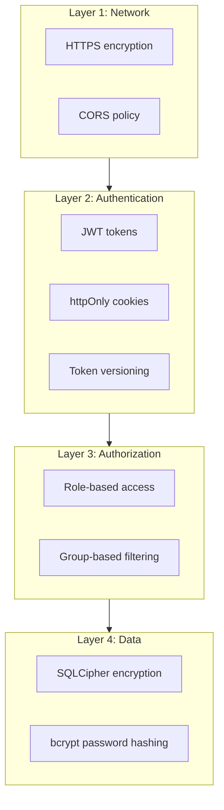

# Security

This page covers how the platform handles security - what's protected, how it's protected, and what to watch out for.

---

## How It Works

The platform uses layered security - multiple independent protections that work even if one fails. The idea is that an attacker has to get through several barriers, not just one.



---

## What's Protected and How

### Passwords

Passwords are hashed with bcrypt before storage. bcrypt is intentionally slow (~100ms per hash), which makes brute force attacks impractical. Each hash includes a random salt, so identical passwords produce different hashes.

```python title="backend/core/security.py"
from passlib.context import CryptContext

pwd_context = CryptContext(schemes=["bcrypt"], deprecated="auto")

# Storing - only the hash is saved
password_hash = pwd_context.hash(plain_password)

# Verifying - compare against hash
is_valid = pwd_context.verify(plain_password, stored_hash)
```

Passwords are never logged, never stored in plain text, and never returned in API responses.

---

### Authentication Tokens

The platform uses a dual-token system:

| Token | Lifetime | Purpose |
|-------|----------|---------|
| Access token | 30 minutes | Sent with every API request |
| Refresh token | 7 days | Used only to get new access tokens |

Both are stored in httpOnly cookies, which means JavaScript can't access them. This protects against XSS attacks - even if someone injects malicious JavaScript, they can't steal the tokens.

```python title="backend/api/auth.py"
response.set_cookie(
    key="access_token",
    value=access_token,
    httponly=True,                      # Can't be read by JavaScript
    secure=settings.cookie_secure,      # HTTPS only in production
    samesite=settings.cookie_samesite,  # CSRF protection
    max_age=settings.access_token_expire_minutes * 60,
    path="/"
)
```

---

### Token Revocation

JWT tokens normally can't be revoked until they expire. The platform works around this with token versioning.

Each user has a `token_version` counter. When a token is created, it includes the current version. On every request, the platform checks that the token's version matches the user's current version. Incrementing the version instantly invalidates all existing tokens.

```python title="backend/core/dependencies.py"
# On every authenticated request
token_version = payload.get("token_version")
if token_version is None or token_version != user.token_version:
    raise HTTPException(
        status_code=status.HTTP_401_UNAUTHORIZED,
        detail="Token has been revoked"
    )
```

This happens automatically on logout and password change.

---

### Database Encryption

The database is encrypted at rest using SQLCipher (AES-256). Without the encryption key, the database file is unreadable.

```python title="backend/database.py"
conn = sqlcipher3.connect(db_path, check_same_thread=False)
conn.execute(f"PRAGMA key = '{key}'")
conn.execute("PRAGMA cipher_compatibility = 4")
conn.execute("PRAGMA kdf_iter = 256000")
conn.execute("PRAGMA cipher_memory_security = ON")
```

!!! warning "Key Management"
    The encryption key (`DB_ENCRYPTION_KEY`) is the only way to read the database. If you lose it, the data is gone. Back it up securely and keep it separate from the database file.

---

### Access Control

All data access goes through `UserAccessContext`, which is computed once per request:

```python title="backend/core/access_control.py"
@dataclass
class UserAccessContext:
    user: User
    is_admin: bool
    site_ids: set[str]    # Sites this user can access
    site_codes: set[str]
    crop_ids: set[str]

    def require_site_access(self, site_id: str = None, site_code: str = None):
        """Raise 403 if user doesn't have access."""
        if not self.has_site_access(site_id=site_id, site_code=site_code):
            raise HTTPException(
                status_code=status.HTTP_403_FORBIDDEN,
                detail="You don't have access to this site"
            )
```

Every endpoint that returns data filters by `access.site_ids`. Admins bypass filters and see everything.

---

### Rate Limiting

Login and token refresh endpoints are rate-limited to slow down brute force attacks:

```python title="backend/api/auth.py"
@router.post("/login")
@limiter.limit("5/minute")  # 5 attempts per minute per IP
def login(...):
    ...

@router.post("/refresh")
@limiter.limit("10/minute")  # 10 refreshes per minute per IP
def refresh_token(...):
    ...
```

Failed login attempts are also logged in the audit system.

---

## Configuration

### Security Environment Variables

| Variable | Purpose | Notes |
|----------|---------|-------|
| `SECRET_KEY` | Signs access tokens | Generate with `secrets.token_urlsafe(32)` |
| `REFRESH_SECRET_KEY` | Signs refresh tokens | Use a different value from SECRET_KEY |
| `DB_ENCRYPTION_KEY` | Encrypts the database | Back this up securely |
| `COOKIE_SECURE` | Require HTTPS for cookies | Set `true` in production |
| `COOKIE_SAMESITE` | CSRF protection level | `lax` (default) or `strict` |

```bash title="Generate secure keys"
python -c "import secrets; print(secrets.token_urlsafe(32))"
```

---

## Pre-Deployment Checklist

??? abstract "Expand checklist"

    ### Secrets

    - [ ] Changed default admin password (`changeme123`)
    - [ ] Set strong `SECRET_KEY` (32+ bytes, random)
    - [ ] Set strong `REFRESH_SECRET_KEY` (different from SECRET_KEY)
    - [ ] Set `DB_ENCRYPTION_KEY` for production
    - [ ] Backed up encryption key to secure location

    ### Network

    - [ ] HTTPS enabled
    - [ ] `COOKIE_SECURE=true`
    - [ ] CORS configured for actual domain
    - [ ] `DEBUG=false`

    ### Verification

    - [ ] Test login/logout flow
    - [ ] Test password change (should invalidate tokens)
    - [ ] Verify audit logging works
    - [ ] Confirm database is encrypted (check file header)

---

## Checklist for New Features

When adding features, verify:

??? abstract "Authentication"

    - [ ] Endpoint requires authentication (uses `CurrentUser` or `AccessContext`)
    - [ ] Admin endpoints check `access.is_admin`

??? abstract "Authorization"

    - [ ] Data filtered by `access.site_ids`
    - [ ] Specific resources checked with `access.require_site_access()`
    - [ ] Users can't access other users' data

??? abstract "Input Validation"

    - [ ] All inputs have Pydantic schemas
    - [ ] Strings have length limits
    - [ ] Numbers have range limits where appropriate

??? abstract "Output Safety"

    - [ ] Sensitive fields excluded from responses (password_hash, etc.)
    - [ ] Error messages don't leak internal details

??? abstract "Logging"

    - [ ] Security-relevant actions are audit logged
    - [ ] Sensitive data not written to logs

---

## Common Attack Mitigations

| Attack | How It's Handled |
|--------|------------------|
| **SQL Injection** | SQLAlchemy ORM parameterizes all queries |
| **XSS** | Tokens in httpOnly cookies (JS can't access); React escapes output |
| **CSRF** | SameSite cookie policy; state parameter in OAuth |
| **Brute Force** | Rate limiting; bcrypt is slow; failed attempts logged |
| **Session Hijacking** | Short-lived tokens; HTTPS; instant revocation via versioning |
| **Data Breach (at rest)** | SQLCipher encrypts entire database |

---

## If Something Goes Wrong

### Suspected Compromise

1. **Contain** - Increment `token_version` for affected users (invalidates all their tokens), disable accounts if needed
2. **Investigate** - Check audit logs for unusual activity
3. **Fix** - Address whatever allowed the compromise
4. **Rotate** - Change any potentially exposed secrets

### Invalidate a User's Tokens

```python
# In a Python shell with database access
user = db.query(User).filter(User.email == "user@example.com").first()
user.token_version += 1
db.commit()
# All their tokens are now invalid - they'll need to log in again
```

### If You Commit a Secret to Git

1. Rotate the secret immediately - consider it compromised
2. Remove from Git history using BFG Repo-Cleaner or `git filter-branch`
3. Force push (coordinate with team)
4. Verify removal across all branches

---

## What's Not Protected

Be aware of what the platform doesn't handle:

| Not Protected | Notes |
|---------------|-------|
| DDoS attacks | Use a CDN/WAF in front of the app |
| Insider threats | Legitimate users can access their authorized data |
| Physical server access | If someone has the server, encryption helps but isn't complete protection |
| Social engineering | Can't prevent users from being tricked |

!!! tip "Consider Adding 2FA"
    For production deployments, consider adding a second authentication layer with an external provider like Cloudflare Zero Trust, Duo, or your organization's identity provider. A reverse proxy with 2FA in front of the app gives you two independent auth layers without modifying application code.

---

## File Reference

| File | Security Role |
|------|---------------|
| `backend/core/security.py` | Token creation/verification, password hashing |
| `backend/core/dependencies.py` | Auth injection, cookie handling, token version check |
| `backend/core/access_control.py` | Group-based access filtering |
| `backend/core/rate_limit.py` | Rate limiting setup |
| `backend/api/auth.py` | Login, logout, refresh endpoints |
| `backend/database.py` | SQLCipher encryption |
| `backend/config.py` | Security settings |
