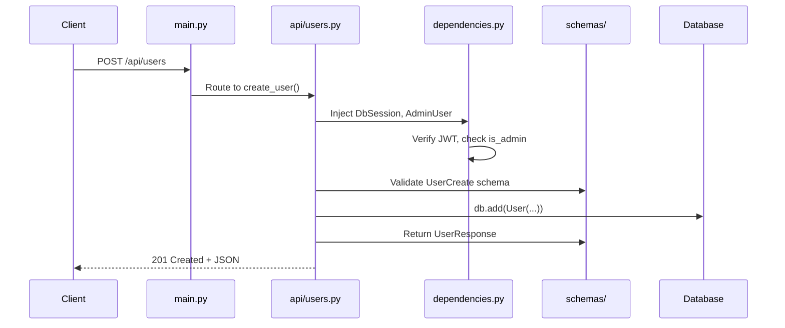

# Backend

FastAPI + Python backend structure and patterns.

**Official docs:** [FastAPI Tutorial](https://fastapi.tiangolo.com/tutorial/) | [Python Tutorial](https://docs.python.org/3/tutorial/)

---

## Folder Structure

```
backend/
├── api/                    # Route handlers
│   ├── __init__.py         # Combines all routers
│   ├── auth.py             # /api/auth/*
│   ├── users.py            # /api/users/*
│   ├── groups.py           # /api/groups/*
│   ├── sites.py            # /api/sites/*
│   ├── sensors.py          # /api/sensors/*
│   ├── admin.py            # /api/admin/*
│   ├── pipeline.py         # /api/pipeline/*
│   └── box.py              # /api/box/*
├── core/                   # Shared utilities
│   ├── security.py         # Token creation, password hashing
│   ├── dependencies.py     # FastAPI dependency injection
│   └── access_control.py   # Group-based access logic
├── models/                 # SQLAlchemy database models
├── schemas/                # Pydantic request/response shapes
├── services/               # Business logic
├── config.py               # Settings from environment
├── database.py             # Database connection
└── main.py                 # Application entry point
```

---

## Layers

### API (`api/`)

Route handlers. Each file is a router for a group of related endpoints:

```python
# backend/api/users.py
router = APIRouter()

@router.get("")              # GET /api/users
def list_users(...): ...

@router.post("")             # POST /api/users
def create_user(...): ...

@router.get("/{user_id}")    # GET /api/users/123
def get_user(...): ...
```

Routers are combined in `api/__init__.py` and mounted in `main.py`:

```python
# main.py
app.include_router(api_router, prefix="/api")
```

### Core (`core/`)

Shared utilities used across the application.

**security.py** - Cryptographic operations:

```python
create_access_token(data: dict) -> str
create_refresh_token(data: dict) -> str
verify_password(plain: str, hashed: str) -> bool
get_password_hash(password: str) -> str
```

**dependencies.py** - FastAPI dependency injection:

```python
# Type aliases for cleaner route signatures
CurrentUser = Annotated[User, Depends(get_current_user)]
AdminUser = Annotated[User, Depends(get_current_admin_user)]
DbSession = Annotated[Session, Depends(get_db)]
AccessContext = Annotated[UserAccessContext, Depends(get_access_context)]

# Usage in routes
@router.get("/users")
def list_users(db: DbSession, admin: AdminUser):
    return db.query(User).all()
```

**access_control.py** - Group-based filtering:

```python
@dataclass
class UserAccessContext:
    user: User
    is_admin: bool
    site_ids: set[str]
    site_codes: set[str]
    crop_ids: set[str]
```

### Models (`models/`)

SQLAlchemy models define database tables:

```python
# backend/models/user.py
class User(Base):
    __tablename__ = "users"

    id: Mapped[str] = mapped_column(String(36), primary_key=True)
    email: Mapped[str] = mapped_column(String(255), unique=True)
    password_hash: Mapped[str] = mapped_column(Text)
    full_name: Mapped[str] = mapped_column(String(255))
    is_admin: Mapped[bool] = mapped_column(Boolean, default=False)
    is_active: Mapped[bool] = mapped_column(Boolean, default=True)
    token_version: Mapped[int] = mapped_column(Integer, default=1)

    groups: Mapped[list["UserGroup"]] = relationship(...)
```

### Schemas (`schemas/`)

Pydantic schemas for API input/output:

```python
# backend/schemas/user.py
class UserCreate(BaseModel):
    email: EmailStr
    password: str
    full_name: str
    is_admin: bool = False

class UserResponse(BaseModel):
    id: str
    email: str
    full_name: str
    is_admin: bool
    groups: list[str]  # Computed from relationships
```

**Why separate from models?**

- Models define database structure (includes `password_hash`)
- Schemas define API structure (excludes sensitive fields)
- Schemas can have computed fields, validation

### Services (`services/`)

Business logic that doesn't belong in routes:

```python
# backend/services/auth.py
def authenticate_user(db: Session, email: str, password: str) -> User | None:
    user = db.query(User).filter(User.email == email).first()
    if not user or not verify_password(password, user.password_hash):
        return None
    return user
```

---

## Request Flow



---

## API Reference

### Authentication (`/api/auth`)

| Endpoint | Method | Auth | Description |
|----------|--------|------|-------------|
| `/login` | POST | No | Get tokens |
| `/logout` | POST | Yes | Invalidate tokens |
| `/refresh` | POST | No | Refresh tokens |
| `/me` | GET | Yes | Current user info |

### Users (`/api/users`) - Admin only

| Endpoint | Method | Description |
|----------|--------|-------------|
| `/` | GET | List all users |
| `/` | POST | Create user |
| `/{id}` | GET | Get user |
| `/{id}` | PUT | Update user |
| `/{id}` | DELETE | Delete user |

### Groups (`/api/groups`) - Admin only

| Endpoint | Method | Description |
|----------|--------|-------------|
| `/` | GET | List groups |
| `/` | POST | Create group |
| `/{id}` | GET | Get group with members/sites |
| `/{id}` | PUT | Update group |
| `/{id}` | DELETE | Delete group |
| `/{id}/users` | POST | Add user to group |
| `/{id}/users/{uid}` | DELETE | Remove user |
| `/{id}/sites` | POST | Add site to group |
| `/{id}/sites/{sid}` | DELETE | Remove site |

### Admin (`/api/admin`) - Admin only

| Endpoint | Method | Description |
|----------|--------|-------------|
| `/stats` | GET | System statistics |
| `/audit` | GET | Audit logs |
| `/audit/export` | GET | Export audit logs |
| `/sites` | GET | List all sites |
| `/sites` | POST | Create site |
| `/sites/{id}` | PUT | Update site |
| `/sites/{id}` | DELETE | Delete site |

### Sites (`/api/sites`) - Group-filtered

| Endpoint | Method | Description |
|----------|--------|-------------|
| `/` | GET | List accessible sites |
| `/crops` | GET | List crop types |

### Sensors (`/api/sensors`) - Group-filtered

| Endpoint | Method | Description |
|----------|--------|-------------|
| `/data` | GET | Get sensor readings |
| `/parameters` | GET | List parameters |

---

## Error Handling

```python
from fastapi import HTTPException, status

if not user:
    raise HTTPException(
        status_code=status.HTTP_404_NOT_FOUND,
        detail="User not found"
    )
```

| Code | When |
|------|------|
| 200 | Successful GET/PUT |
| 201 | Successful POST |
| 204 | Successful DELETE |
| 400 | Invalid input |
| 401 | Missing/invalid auth |
| 403 | No permission |
| 404 | Not found |

---

## API Documentation

FastAPI generates interactive docs automatically:

- **Swagger UI:** `http://localhost:8000/docs`
- **ReDoc:** `http://localhost:8000/redoc`

---

## Next Steps

- [Frontend](frontend.md) - React structure
- [Authentication](../features/authentication.md) - Auth deep dive
- [Decisions](../how-i-built-this/decisions.md) - Why these patterns
