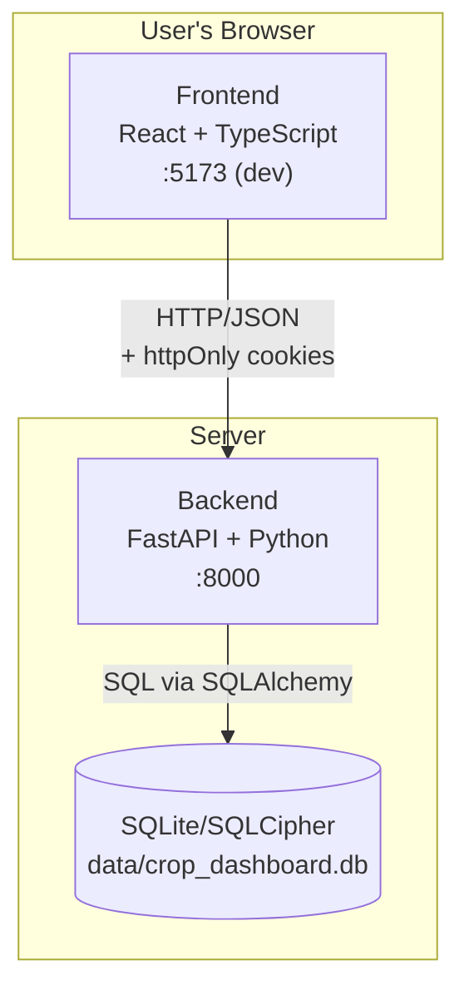
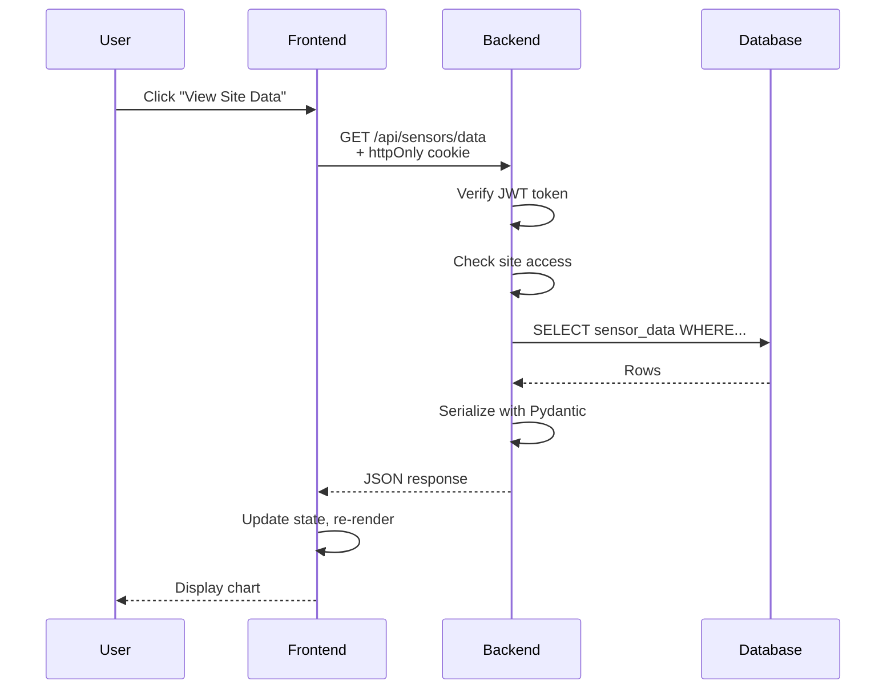

# Stack Overview

How the pieces connect - frontend, backend, and database.

---

## Architecture



**Development mode:** Two processes with hot reload - frontend on `:5173`, backend on `:8000`.

**Production mode:** Single container serves everything from `:8000`. Frontend is built and served as static files.

---

## Technology Stack

### Backend

| Technology | Purpose |
|------------|---------|
| [Python 3.11+](https://www.python.org/) | Programming language |
| [FastAPI](https://fastapi.tiangolo.com/) | Web framework, routing, validation |
| [uvicorn](https://www.uvicorn.org/) | ASGI server |
| [SQLAlchemy 2.0](https://www.sqlalchemy.org/) | ORM - Python objects for database tables |
| [Pydantic](https://docs.pydantic.dev/) | Request/response validation |
| [python-jose](https://github.com/mpdavis/python-jose) | JWT token handling |
| [passlib](https://passlib.readthedocs.io/) + [bcrypt](https://github.com/pyca/bcrypt) | Password hashing |
| [SQLCipher](https://www.zetetic.net/sqlcipher/) | Database encryption |

### Frontend

| Technology | Purpose |
|------------|---------|
| [React 18](https://react.dev/) | UI framework |
| [TypeScript](https://www.typescriptlang.org/) | Type-safe JavaScript |
| [Vite](https://vitejs.dev/) | Build tool, dev server |
| [React Router](https://reactrouter.com/) | Client-side navigation |
| [Zustand](https://github.com/pmndrs/zustand) | State management |
| [Tailwind CSS](https://tailwindcss.com/) | Styling |
| [Plotly.js](https://plotly.com/javascript/) | Charts (Crop Sensing Group's visualizations) |
| [Leaflet](https://leafletjs.com/) | Maps (Crop Sensing Group's visualizations) |
| [Axios](https://axios-http.com/) | HTTP client |

---

## Data Flow

What happens when a user views sensor data:



Key points:

- Authentication happens via httpOnly cookies (browser sends automatically)
- Backend verifies token and checks access before querying
- Pydantic validates response shape before sending
- Frontend receives JSON, updates state, React re-renders

---

## Project Structure

```
crop-dashboard-platform/
├── backend/
│   ├── api/                 # Route handlers
│   │   ├── auth.py          # Login, logout, refresh
│   │   ├── users.py         # User CRUD
│   │   ├── groups.py        # Group management
│   │   ├── sites.py         # Site data
│   │   ├── sensors.py       # Sensor data endpoints
│   │   ├── admin.py         # Admin operations
│   │   ├── pipeline.py      # Data import
│   │   └── box.py           # Box.com integration
│   ├── core/
│   │   ├── security.py      # Token creation, hashing
│   │   ├── dependencies.py  # FastAPI dependencies
│   │   └── access_control.py # Group-based access
│   ├── models/              # SQLAlchemy models
│   ├── schemas/             # Pydantic schemas
│   ├── services/            # Business logic
│   ├── config.py            # Settings
│   ├── database.py          # DB connection
│   └── main.py              # Entry point
│
├── frontend/
│   └── src/
│       ├── components/      # Reusable UI
│       ├── pages/           # Page components
│       │   ├── admin/       # Admin panel
│       │   ├── Dashboard.tsx
│       │   └── Login.tsx
│       ├── stores/          # Zustand stores
│       │   ├── authStore.ts
│       │   └── themeStore.ts
│       ├── lib/
│       │   └── api.ts       # Axios client
│       └── App.tsx          # Root + routing
│
├── data/                    # Database (gitignored)
└── uploads/                 # File pipeline (gitignored)
    ├── staging/             # Files awaiting processing
    └── processed/           # Archived after import
```

---

## Communication

### Frontend → Backend

| Method | When | Example |
|--------|------|---------|
| GET | Fetching data | `GET /api/sensors/data?site_code=VAC_001` |
| POST | Creating, actions | `POST /api/auth/login` |
| PUT | Updating | `PUT /api/users/{id}` |
| DELETE | Removing | `DELETE /api/users/{id}` |

All requests include credentials (httpOnly cookies sent automatically).

### Backend → Database

SQLAlchemy translates Python to SQL:

```python
# Python
db.query(User).filter(User.email == email).first()

# Becomes SQL
SELECT * FROM users WHERE email = ? LIMIT 1
```

---

## Development vs Production

=== "Development"

    ```
    Terminal 1: Backend (uvicorn --reload)
    Terminal 2: Frontend (npm run dev)

    - Two processes
    - Hot reload on both
    - CORS enabled for cross-origin
    ```

=== "Production"

    ```
    Single process serves everything

    /api/*     → FastAPI routes
    /assets/*  → Static files (JS, CSS)
    /*         → index.html (SPA)

    - No CORS needed (same origin)
    - Frontend built into backend container
    ```

---

## Next Steps

- [Backend](backend.md) - FastAPI code structure
- [Frontend](frontend.md) - React code structure
- [Authentication](../features/authentication.md) - How login works
